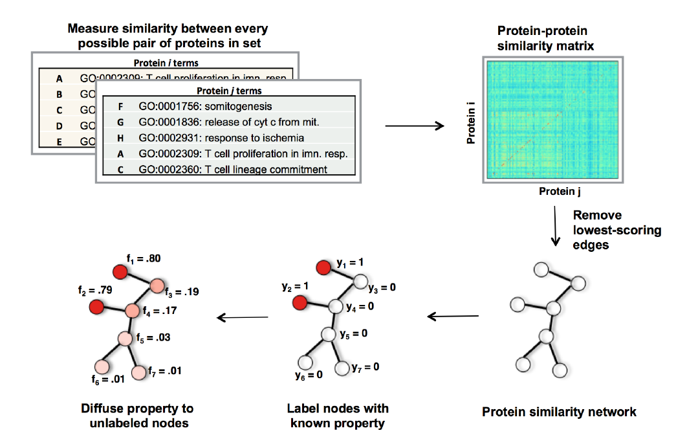

# GGID

Protein annotation via Information Diffusion over GO-derived protein Graphs.
The deployed app lives [here](https://ggid.herokuapp.com/).


[](https://github.com/psf/black)
[](https://www.codefactor.io/repository/github/ily123/ggid)

## Table of Content
1. [Graphical Abstract](#graphical-abstract)
2. [Overview](#overview)
3. [Installation](#installation)
4. [Deployment](#deployment)
5. [License](#license)

## Graphical Abstract 


## Overview
A detailed description of the method is available as part of the deployed application (THEORY tab).
However, here is a brief overview:

* We can annotate proteins by propagating/diffusing labels through protein networks

* I created a new type of network for the human kinases, one based purely on GO term annotations

* To diffuse labels through this network, I also created a web-app interface
    using the [Dash](https://dash.plotly.com/) framework combined with the [Cytoscape](https://github.com/plotly/dash-cytoscape) library

* In this repo are both the code to create the network, and code for the Dash web app

## Installation

Assuming you have python3.6+ installed:

1. Clone repo to local machine with

    ```$ git clone https://github.com/ily123/ggid```

2. Create a virtual env
3. Inside the env, install dependencies with

    ```$ pip install -r requirements.txt```

## Usage
1. The network needed to run the front-end is pre-computed (```netowrk/kinase_matrix.pkl```),
so to run the front-end locally issue the following command in your terminal:

    ```$ python application.py```

    and then open the app in your browser at ```localhost:8050```.
2. To regenerate/modify the network, run the ```create_go_similarity_kinase_network.ipynb```
notebook and follow it cell by cell.
    - Note: the Gene Ontology files (annotations and the term ontology) that the network is constructed from
    are included under ```data/```. You can manually download the latest versions of these files from
    the [Gene Ontology website](http://geneontology.org/docs/downloads/). The code expects ```gaf-2``` format
    for the annotation corpus, and ```obo``` for the term ontology.
3. There are a couple of other notebooks included, one has some exploratory analysis (```_explore_human_annotations.ipynb```)
and the other scrapes human kinase names from uniprot (```_get_human_kinases_from_uniprot.ipynb```). The kinases
are already included under ```data/```, but you can re-run the notebook if you want to update the list.

## Deployment

The front-end is a Flask app, so it can be deployed seemlessly with most cloud providers.
I deployed it with Heroku, and it was rather painless. Note that if you plan to plug
in a proteome-scale network into the tool, you'll have to account for additional space/time
requirements. The tool, as is, is designed for a small network with near-instant diffusion
times.

## License

I don't know how to license this repo.

Parts of this work have been published & publicly presented before, so I imagine 
they are part of public domain now. So feel free to fork.

That being said, I am not an IP lawyer, so on the tiny off-chance you plan to use this code
commercially, message me on github/linkedin/etc and I can put you in touch
with people who know the answer.
